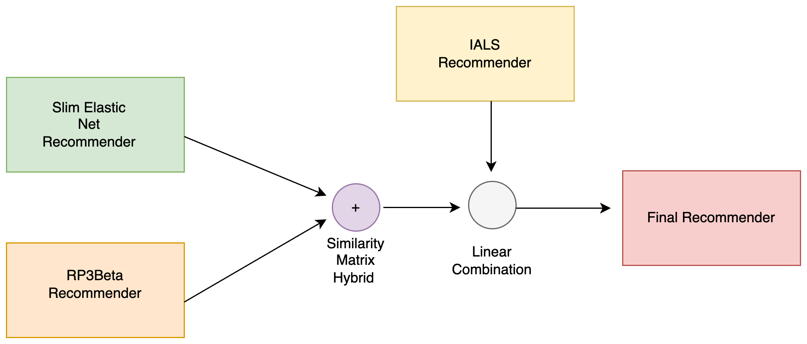

# Recommender System 2024 Challenge - Polimi

  

    

This repo contains the code and the data used in the [Polimi's Recsys Challenge 2024](https://www.kaggle.com/competitions/recommender-system-2024-challenge-polimi)
 
The goal of the competition was to create a recommender system for books, providing 10 recommendations for each user.

## Results

* MAP@10 - private: &nbsp;0.10393
* MAP@10 - public: &nbsp;0.10249
* Ranked 5th

## Goal
The application domain is book recommendation. The datasets we provide contains interactions of users with books. The main goal of the competition is to discover which new books a user will interact with.

# Dataset
The datasets includes around 1.9 M interactions, 35k users, 38k items (books) as well as 94k item features.
The training-test split is done via random holdout, 80% training, 20% test.
The goal is to recommend a list of 10 potentially relevant new items for each user. MAP@10 is used for evaluation.

## Evaluation
The evaluation metric for this competition was MAP@10.

# Recommender

  

Our best recommender is a hybrid composed of
* SLIM ElasticNet
* RP3Beta
* IALS

Some interesting notebooks can be found in [Notebooks](/MyNotebooks)

## Hyperparameter Tuning
Hyperparameter tuning played a pivotal role in enhancing the performance of our recommender system. To achieve this, we leveraged Optuna for its efficient optimization capabilities.

Initially, 80% of the user-interaction dataset was used to conduct multiple [Optuna](https://optuna.org/) runs. Once an approximate range of optimal solutions was identified, we refined the hyperparameter space and restarted the trials, accelerating convergence while maintaining precision. Additionally, whenever feasible within the constraints of time and computational resources, k-fold cross-validation was employed to further validate the robustness and reliability of the tuned hyperparameters.
## Credits
This repository is based on [Official Polimi Recommender Systems repository](https://github.com/recsyspolimi/RecSys_Course_AT_PoliMi)